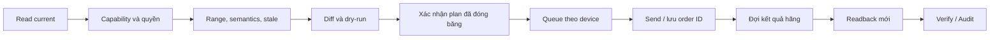
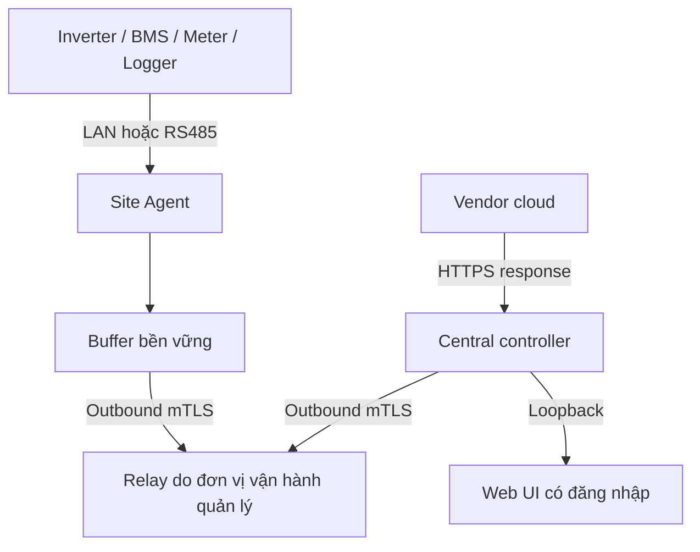

# Nghiên cứu và kiến trúc Solar Fleet EMS

## A. Executive summary

Nền tảng được thiết kế cho đơn vị EPC quản lý nhiều khách hàng, kết hợp giám sát, vận hành, bảo trì và điều khiển có kiểm chứng. Quyết định kiến trúc là controller tại văn phòng, UI có xác thực trên `127.0.0.1`, adapter cloud độc lập và Site Agent tại từng công trình. Khả năng của inverter, logger, tài khoản và firmware phải được xác định riêng; thương hiệu không phải là một capability.

Bản nghiên cứu chốt ngày 13/09/2026, trước khi code. Đây là baseline để triển khai, chưa phải chứng nhận tương thích thiết bị. Tại thời điểm baseline chưa có tài khoản API, model/logger/firmware và thiết bị kiểm thử của dự án; không vendor nào đạt nhãn `Supported` theo tiêu chí end-to-end của MVP. Có thể triển khai transport thật, lưu trữ, domain, kiểm soát truy cập và kiểm thử hợp đồng ngay. Những mapping không đủ bằng chứng phải dừng ở `UNKNOWN`.

Bổ sung sau baseline: người dùng cho phép kiểm tra Deye Cloud đã đăng nhập. Quan sát một hybrid ba pha LV 16 kW xác nhận protocol/firmware hiển thị, module logger và upload/acquisition một phút; config có cache từ tháng trước. Ghi chép đã loại dữ liệu nhận diện tại [Deye account observation](deye-account-observation.md), nguồn E `DEYE_UI_OBS_001`. Tổng nguồn hiện là 38. Exact model và quyền OpenAPI/write-readback vẫn chưa được xác minh; quan sát này không mở khóa control. Tiến độ code thực tế tại [implementation status](implementation-status.md).

Deye là adapter đầu tiên. Danh mục công khai và introspection chính thức xác nhận các endpoint OpenAPI v1.0 cho discovery, latest/history, alarms, cấu hình, lệnh và kết quả lệnh. Có schema cho TOU, work mode, solar sell, giới hạn công suất, battery, smart load và dynamic control. Endpoint tồn tại chưa chứng minh một thiết bị cụ thể nhận lệnh hoặc một account có quyền ghi. [DEYE_API_001](https://developer.deyecloud.com/openmcp/docs/deye-open-mcp-tools.html), [DEYE_TRANSPORT_001](https://developer.deyecloud.com/openmcp/docs/deye-open-mcp-guide.html).

Các tài liệu còn thiếu và giới hạn từng kết luận nằm trong [source audit](vendor-source-audit.md), [compatibility matrix](vendor-compatibility-matrix.md), [control mapping](universal-control-mapping.md) và [research questions](vendor-research-questions.md). Các file này là nguồn quyết định; không lấy nội dung từ blog hay repo cộng đồng để cho phép ghi production.

## B. Verified vendor matrix

| Phạm vi xác minh | Kết luận có nguồn | Trạng thái tích hợp dự án |
|---|---|---|
| Deye OpenAPI v1.0 / OpenMCP v1.2 | API đọc và nhóm điều khiển được công bố; kết quả có order ID. Model, firmware, quyền thực tế chưa biết. [DEYE_API_001](https://developer.deyecloud.com/openmcp/docs/deye-open-mcp-tools.html) | FIRST ADAPTER, HARDWARE UNVERIFIED |
| SolisCloud public API, support article 22/08/2024 | Quy trình bài viết dành cho end user; phân biệt rõ với remote control. Phải xác nhận lại account installer qua hãng. [SOLIS_API_001](https://solis-service.solisinverters.com/en/support/solutions/articles/44002212561-request-api-access-soliscloud) | MONITORING PATH DOCUMENTED; ADAPTER NOT IMPLEMENTED |
| Solis hybrid / installer UI | Chức năng menu phụ thuộc model/firmware; owner không thấy mọi tham số của installer. [SOLIS_UI_001](https://solis-service.solisinverters.com/en/support/solutions/articles/44002638862-solis-cloud-remote-control-settings-desktop-version) | UI control evidence, chưa có public write mapping |
| GoodWe SEMS organization / bên thứ ba được cấp quyền | OpenAPI, realtime read API và batch control là ba sản phẩm khác nhau; batch dùng Kafka. [GOODWE_API_001](https://community.goodwe.com/static/images/2024-08-20597794.pdf) | PARTNER ACCESS REQUIRED |
| Sungrow iSolarCloud O&M Ver26 / VPP | Tài liệu có API dispatch và quyền bên thứ ba; chưa có API contract cho dự án. [SUNGROW_OM_001](https://info-support.sungrowpower.com/product-materials/8cc7a6f7-36ff-4489-b9af-15546dc42ca2.pdf) §2.3.13.1.1.7 | PARTNER ACCESS REQUIRED |
| Huawei SmartPVMS + SmartLogger | REST northbound login và industrial scheduling là các đường riêng. [HUAWEI_AUTH_001](https://info.support.huawei.com/enterprise/en/doc/EDOC1100307213/9e1a18d2/login-interface), [HUAWEI_SCHED_001](https://info.support.huawei.com/DpinfoAppDoc/pro_erp_slice001/doc/fusion_solar/public/commercial_energy/en/en-us_topic_0000002205688713.html) | MODEL/PROTOCOL PROFILE REQUIRED |
| Growatt OSS / remote setting page | Có thao tác cài đặt từ xa, nhưng form công khai không đủ chứng minh authentication, API contract hoặc quyền. [GROWATT_OSS_001](https://vn.growatt.com/support/faq/monitoring), [GROWATT_SETTING_001](https://openapi.growatt.com/commonDeviceSetC/setTlx?tlxSn=&type=server) | UNKNOWN PROGRAMMABLE CONTROL |
| SOLARMAN platform / logger | Điều khiển tùy biến cần quyền và protocol của OEM inverter. [SOLARMAN_CONTROL_001](https://helpcenter.solarmanpv.com/portal/en/kb/articles/how-to-control-inverter-via-api) | TRANSPORT ECOSYSTEM, OEM PROFILE REQUIRED |
| Eybond / SmartESS | Onboarding/cloud và ESS strategy được mô tả; public developer API chưa xác minh. [EYBOND_GUIDE_001](https://fms.eybond.com/fms/api/auth/web/doc/html/previewOnline/72/2), [EYBOND_ESS_001](https://www.eybond.com/Household.html) | UNKNOWN PROGRAMMABLE API |
| Bluesun BSM-5500BLV-48DA và BSE6KL1 | BSM manual chỉ tới SmartESS; BSE tài liệu 2 trang ghi Cloud Platform. Không suy ra cùng OEM. [BLUESUN_BSM_001](https://www.bluesunpv.com/wp-content/uploads/2024/11/BSM-5500BLV-48DA-User-Manual-V2.0.pdf), [BLUESUN_BSE_001](https://www.bluesunpv.com/wp-content/uploads/2024/11/ESS_BSE6KL1_EN_v2406_Rev-01.pdf) | NO GENERIC BLUESUN ADAPTER |

Evidence A = developer/API, B = user/installer manual, C = hardware/protocol, D = support, E = bằng chứng thực tế do chủ dự án cung cấp, F = chưa xác minh. Không có screenshot thực tế trong attachment này; phần prompt nhắc screenshot không được tự tính là evidence E. Bằng chứng cấp A vẫn có thể thiếu applicability ở thiết bị.

## C. Monitoring matrix

| Đường dữ liệu | Discovery / dữ liệu / lịch sử / alarm | Nhịp và quota | Quyết định |
|---|---|---|---|
| Deye cloud | station/device list; latest; history và history theo timestamp; station/device alerts. [DEYE_API_001](https://developer.deyecloud.com/openmcp/docs/deye-open-mcp-tools.html) | Quota account và khoảng cập nhật inverter: UNKNOWN | Poll budget phải cấu hình; không gán LIVE cho dữ liệu cloud |
| Solis cloud | Dịch vụ API đọc được công bố; tài liệu API V2.0 liên kết từ support cần kiểm tra contract trước adapter. [SOLIS_API_001](https://solis-service.solisinverters.com/en/support/solutions/articles/44002212561-request-api-access-soliscloud) | UNKNOWN cho account dự án | Không dùng credential owner hàng loạt làm mặc định |
| GoodWe | SEMS OpenAPI có plant/device/datalogger; realtime riêng đọc raw device/BMS. [GOODWE_API_001](https://community.goodwe.com/static/images/2024-08-20597794.pdf), tr. 3–4 | Tài liệu nêu mặc định 3.600 calls/giờ cho OpenAPI; không áp quota đó cho Kafka/realtime | Đợi hợp đồng, whitelist, authorization và schema |
| Sungrow | Cloud O&M và Logger1000 có thông tin thiết bị, alarm và lịch sử. [SUNGROW_OM_001](https://info-support.sungrowpower.com/product-materials/8cc7a6f7-36ff-4489-b9af-15546dc42ca2.pdf), [SUNGROW_LOGGER_001](https://info-support.sungrowpower.com/application/pdf/2023/03/10/Logger1000A_B-UEN-Ver110-202301.pdf) | API quota/history resolution UNKNOWN | Không suy diễn public API từ màn hình |
| Huawei | Northbound authentication được mô tả; phải xin company admin mở quyền. [HUAWEI_AUTH_001](https://info.support.huawei.com/enterprise/en/doc/EDOC1100307213/9e1a18d2/login-interface), [HUAWEI_FAQ_001](https://info.support.huawei.com/DpinfoAppDoc/pro_erp_slice001/doc/fusion_solar/faq/installer/en/en-us_topic_0000001867081537.html?styleType=white) | Token 30 phút theo tài liệu truy xuất qua index; cần tái xác nhận bản hiện hành | Chưa implement adapter |
| SOLARMAN OpenData | HTTP local, Digest auth, cần enable API và firmware phù hợp. [SOLARMAN_LOCAL_001](https://docs.solarman.ai/docs/api/opendata/) | Không bảo đảm áp dụng mọi stick/logger | Không đưa HTTP local ra WAN |
| Growatt / Eybond / Bluesun | App monitoring được mô tả; programmable contract còn thiếu | UNKNOWN | Để trống dữ liệu, không điền bằng fixture |

Mục tiêu kỹ thuật của dự án: local 1–5 giây khi protocol cho phép, site push SSE, fleet tổng hợp 10–30 giây. Đây là mục tiêu thiết kế, không phải SLA của bất kỳ hãng nào. Dữ liệu thiếu đơn vị hoặc semantics dấu được giữ trong namespace vendor với quality `UNVERIFIED`; canonical không được đoán từ tên trường. `NULL` là chưa biết, không đồng nghĩa 0 W.

## D. Remote-control matrix

Điều khiển cấu hình, lệnh tức thời và dispatch có contract khác nhau. Solis public monitoring không cấp quyền remote control. GoodWe realtime API không có write; OpenAPI organization và batch API có phạm vi quyền riêng. Huawei scheduling được mô tả qua SmartLogger/Modbus TCP/GOOSE/IEC104, không đồng nghĩa toàn bộ REST northbound có write. Các ranh giới này được ghi ở từng dòng trong compatibility matrix.

Đối với Deye, mọi endpoint native đã thấy được giữ trong catalog. Những endpoint thiếu readback hoặc profile model/range sẽ có mô tả cùng lý do khóa; không tạo nút gửi thử. `paramterType` là spelling của contract battery thực tế, không tự sửa thành `parameterType`. Hai enum `SELL_FIRST` và `SELLING_FIRST` thuộc hai command khác nhau. [DEYE_API_001](https://developer.deyecloud.com/openmcp/docs/deye-open-mcp-tools.html).

Đối với mọi hãng, các khả năng firmware update, factory reset, grid code, serial modification và xóa entity tách khỏi normal control. MVP giữ khóa các đường này. Raw command là quyền riêng, cần register map chính thức, xác nhận diff và readback hợp lệ; biết endpoint nhận bytes chưa đủ để mở raw write.

## E. Local protocol matrix

| Thiết bị/phạm vi | Đã xác minh | Phần thiếu |
|---|---|---|
| Deye SUN-(5–12)K-SG04LP3-AU, manual V3.3.0 | Có Modbus/RS485, meter và CT; manual vận hành không thay bảng thanh ghi. [DEYE_MODEL_001](https://hqcdn.hqsmartcloud.com/deyeinverter/2026/01/04/InstallationManual-SUN-5-12K-SG04LP3-AU.pdf) | Register map, protocol revision, firmware và local/cloud arbitration |
| Solis S2-WL-ST | SOP đọc Modbus TCP; port và configuration phụ thuộc logger. [SOLIS_LOCAL_001](https://solis-service.solisinverters.com/en/support/solutions/articles/44002530087-solis-s2-wl-st-modbus-tcp-communication) | Qualified partner phải xin read/write table và NDA qua ticket. [SOLIS_MODBUS_001](https://solis-service.solisinverters.com/en/support/solutions/articles/44002663852-non-nda-modus-table) |
| GoodWe EzLogger3000C | Manual có Modbus TCP, IEC104 và RS485; cấu hình forwarding riêng. [GOODWE_LOGGER_MANUAL_001](https://en.goodwe.com/Skippower/downloadFileF?id=1944&mid=60), §8.2.8 | Mapping thiết bị và revision giao thức |
| Sungrow Logger1000A/B, Ver110-202301 | Modbus TCP server/client, RTU forwarding và IEC104. [SUNGROW_LOGGER_001](https://info-support.sungrowpower.com/application/pdf/2023/03/10/Logger1000A_B-UEN-Ver110-202301.pdf), §7.10.7–8 | Point table cụ thể và thời gian phản hồi phải thử |
| Huawei SmartLogger | Scheduling qua Modbus TCP, GOOSE hoặc IEC104. [HUAWEI_SCHED_001](https://info.support.huawei.com/DpinfoAppDoc/pro_erp_slice001/doc/fusion_solar/public/commercial_energy/en/en-us_topic_0000002205688713.html) | Model SmartLogger/PCS/inverter, protocol maps, quyền và topology |
| SOLARMAN OpenData / EMH-2 | Local API và gateway có cổng RS485, LAN/WAN, P1/DO. [SOLARMAN_LOCAL_001](https://docs.solarman.ai/docs/api/opendata/), [SOLARMAN_EMH_001](https://docs.solarman.ai/docs/emh-2/quick-start/) | Không chứng minh inverter nào cũng điều khiển được qua EMH-2 |
| Bluesun BSM-5500BLV-48DA | RS485/USB/Wi-Fi được nêu. [BLUESUN_BSM_001](https://www.bluesunpv.com/wp-content/uploads/2024/11/BSM-5500BLV-48DA-User-Manual-V2.0.pdf), §5.2–3 | RS485 không tự chứng minh là public Modbus read/write |

## F. Cloud/local coexistence

| Phạm vi | Kết luận | Hệ quả thiết kế |
|---|---|---|
| Solis S2-WL-ST theo SOP 09/01/2025 | Bật TCP/IP ngắt SolisCloud. [SOLIS_LOCAL_001](https://solis-service.solisinverters.com/en/support/solutions/articles/44002530087-solis-s2-wl-st-modbus-tcp-communication) | Phải cảnh báo trước, không tự thay connectivity |
| GoodWe EzLogger3000C | Product page công bố SEMS và third-party monitoring đồng thời, 100 thiết bị và buffer 30 ngày. [GOODWE_LOGGER_001](https://en.goodwe.com/ezlogger3000c) | Chỉ kết luận về monitoring; quyền ưu tiên nhiều controller vẫn UNKNOWN |
| Sungrow Logger1000A/B | Manual có nhiều forwarding service và cloud; chưa đủ khẳng định mọi tổ hợp write cùng lúc | Chờ matrix model/firmware và arbitration test |
| Deye / Huawei / Growatt / SOLARMAN / Eybond / Bluesun | UNKNOWN cho bộ thiết bị của dự án | Giữ cloud như hiện tại, không enable local thay người vận hành |

## G. Universal control model

`Intent` mô tả mục đích vận hành, `CapabilityProfile` chứng minh áp dụng, `CommandPlan` mô tả thao tác cụ thể và `Execution` ghi thực tế. Intent gồm target scope, thông số có đơn vị, thời hạn, schedule location, semantics và các điều kiện trước/sau. Device identity gồm vendor, actual OEM, product family, inverter model, logger model, battery, firmware, protocol revision, account type, privilege và region.

Compiler trả `exact`, `approximate`, `unsupported` hoặc `requires_manual_configuration`. Một mapping chưa có profile thực tế luôn bị khóa. Mapping approximate phải nêu điều gì không được đảm bảo và yêu cầu xác nhận riêng; không tự nâng thành exact. Mọi 34 intent trong yêu cầu có dòng ở [universal-control-mapping.md](universal-control-mapping.md), kể cả các dòng UNKNOWN.

Ví dụ thiết kế quan trọng: `SET_RESERVE_SOC` không được chuyển thành Deye `BATT_LOW`. Ngưỡng pin thấp, ngưỡng shutdown, SOC từng slot và dung lượng dự phòng là những ý nghĩa khác nhau. `SET_ZERO_EXPORT` cũng cần xem work mode, solar sell, meter/CT, scope giới hạn từng pha/tổng, hard/soft limit và hành vi meter offline. Manual AU SG04LP3 mô tả khác nhau giữa load port và toàn bộ tải nhà, đồng thời có cách mô tả hard/soft limit cần xác nhận đúng firmware trước khi chuẩn hóa. [DEYE_MODEL_001](https://hqcdn.hqsmartcloud.com/deyeinverter/2026/01/04/InstallationManual-SUN-5-12K-SG04LP3-AU.pdf), §5.7.

Không có loop optimizer trong giai đoạn đầu. Dispatch tương lai dùng target W/var, deadline, ramp, TTL, priority và fallback độc lập. Config API không được dùng mỗi giây để giả lập dispatch.

## H. Data model và lưu trữ

Entity: Organization → Customer → Site → Device; Device có type inverter/logger/gateway/battery/BMS/meter/CT/generator/EV/EPS. Quan hệ nhiều thiết bị–nhiều transport được biểu diễn qua IntegrationBinding. SOLARMAN và Eybond là monitoring platform; inverter vendor/OEM là field khác. Logger có SN, model, firmware, association, last_seen và các network field nullable.

Mỗi sample có `source`, `source_timestamp`, `received_at`, `latency_ms`, `quality`, `stale`, `device_id`, metric và unit. Canonical power dùng W, energy Wh, điện áp V, dòng A, tần số Hz, nhiệt độ °C, SOC/SOH %. Dữ liệu kWh từ hãng được chuyển sang Wh khi unit đã xác minh. Import/export và charge/discharge lưu riêng, không âm. UI chỉ animate theo canonical hướng đã xác định.

Sample identity là `(binding, device, metric, source_timestamp, source_sequence)`; backfill không đổi thời điểm đo. Selector ưu tiên direct local → Site Agent → cloud sau khi kiểm tra chất lượng và stale. Nguồn stale không thắng nguồn fresh chỉ vì ưu tiên cao. Không ghép các metric từ thời điểm quá lệch thành một flow; discrepancy được giữ với provenance để chẩn đoán.

Đánh giá scale: 500 site × 5 thiết bị × 30 metric ÷ 5 giây = 15.000 point/giây, khoảng 1,296 tỷ point/ngày. Đây là ước tính thiết kế, không phải benchmark. SQLite WAL phù hợp controller pilot, metadata, audit, outbox và mẫu đã giới hạn retention; không phù hợp lưu vô hạn toàn fleet ở nhịp đó. Tách repository time-series để chuyển PostgreSQL partitioning/Timescale khi có đo tải thực. Raw retention ngắn, aggregate 1 phút/15 phút/ngày; counter reset, DST và gap không được tích phân như dữ liệu liên tục.

Các chỉ số self-consumption, self-sufficiency, specific yield, availability và alarm frequency chỉ tính khi có đủ đầu vào và coverage. Không gọi hiệu suất nếu thiếu đo điện năng/baseline; pin sạc từ lưới làm phân bổ PV self-use cần provenance bổ sung.

## I. Command lifecycle

Trạng thái: CREATED, VALIDATING, READY, SENDING, ACCEPTED, WAITING_DEVICE, VERIFYING, VERIFIED, FAILED, TIMEOUT, UNSUPPORTED, CANCELLED. HTTP 200 và vendor success chỉ là một bước. ACK đến muộn sau timeout chỉ được reconcile cùng order ID, không tự gửi lại. Unknown outcome sau khi kết nối đứt được giữ TIMEOUT và khóa retry theo idempotency key.

Plan chứa previous/requested/expected readback, danh sách call, evidence, risks, expires_at và hash. Execute chỉ nhận plan ID/hash, không nhận payload sửa tùy ý. Trước gửi đọc lại current, so sánh snapshot và kiểm tra lại role, device profile, online, TTL và flag ghi. Một worker/controller duy nhất cho pilot; DB unique idempotency constraint và device serialization. Multi-process cần lease/queue bền vững trước khi scale.

Bulk là tập execution độc lập, preview riêng từng device, không transaction nguyên tử toàn fleet. Không tự rollback inverter khi một phần thất bại. Audit giữ từng call, order ID, readback và trạng thái; không có `success=true` đại diện tất cả.

Freshness của readback là điều kiện bắt buộc. Config response không có timestamp không tự chứng minh thông số vừa đọc từ inverter. Đường Deye dynamic read trả order ID là ứng viên cho readback có vòng lệnh riêng; phải kiểm chứng trên hardware. Không được dùng cached equality để báo VERIFIED.

## J. RBAC và security

| Role | Quyền mặc định |
|---|---|
| Viewer | Xem site được cấp, telemetry, alarm |
| Operator | Quick control đã được xác minh và nằm trong scope |
| Installer | Common advanced/commissioning đã được xác minh |
| Senior Engineer | Vendor-native/advanced; grid unlock riêng |
| Administrator | Account, integrations và RBAC; không tự động có quyền raw |

ACL theo customer/site phải áp dụng cả read, history, stream, command và log; frontend không phải ranh giới phân quyền. Raw/Grid là permission riêng, không kế thừa chỉ từ nhãn Administrator. Cần log riêng cho login thất bại, thay credentials, role và unlock. Không có bulk grid-code mặc định.

UI loopback vẫn dùng session authentication, password hash chậm, cookie HttpOnly/SameSite, kiểm tra Origin/CSRF và Host chống DNS rebinding. Không CORS wildcard. API secrets mã hóa tại rest; master key ở OS keyring hoặc external secret, tách DB/backup. Token và secret không trả về client, không nằm trong exception, log hoặc audit. Vendor base URL là allowlist HTTPS theo data center, không cho nhập URL bất kỳ để tránh SSRF/credential exfiltration.

Development mặc định READ ONLY. Điều khiển thật cần feature flag + quyền + profile chính thức + confirmation + readback. Test tự chặn outbound network; opt-in hardware là quy trình riêng. Không thử mật khẩu khách, bypass quyền hoặc lấy cookie/mobile API riêng. Không gửi email xin access thay khách hàng nếu chưa được yêu cầu.

## K. Site Agent architecture

Localhost văn phòng không thể nhận kết nối Internet từ site ở tỉnh khác. Nếu cả site và văn phòng không mở inbound, cần relay/broker có địa chỉ routable do đơn vị vận hành quản lý, hoặc kết nối mạng riêng đã triển khai. Không tự tạo relay, tunnel hay public service ở lần chạy này. Broker là boundary độc lập; có thể yêu cầu payload encryption end-to-end nếu broker không được phép đọc telemetry.

Mỗi agent có identity/certificate riêng, rotate/revoke, allowlist thiết bị và protocol profile. Buffer có giới hạn dung lượng, dedupe, sequence, timestamp gốc và backfill. WAN mất thì tiếp tục đọc; policy lưu trong inverter vẫn chạy. Policy do central thực thi ngừng khi central offline và phải hiển thị điều đó. Agent offline execution chỉ được mở sau khi xác minh lease, TTL và quyền điều khiển xung đột. Không chốt Raspberry Pi hay gateway công nghiệp trước khi biết giao thức/tải.

## L. UI information architecture

UI chính tiếng Việt. Fleet gồm khách hàng, địa điểm, vendor, inverter/logger, system size, trạng thái, cảnh báo, nguồn và lần nhận cuối; filter vendor/status/model/customer. Site detail gồm Tổng quan, Dữ liệu, Thiết bị, Điều khiển, Lịch, Cảnh báo, Chẩn đoán, Nhật ký. Logger có màn hình và trạng thái riêng.

Bốn cấp điều khiển: Cơ bản, Nâng cao, Vendor Native, Expert/Raw. Backend cung cấp capability và lý do unavailable. Không xóa tham số chỉ vì UI khó; catalog native giữ các field chưa mở cùng evidence/unknowns. Owner chỉ thấy menu và site phù hợp. Mobile ưu tiên flow, trạng thái, alarm và quick control, dùng disclosure cho phần kỹ thuật.

Flow không có dữ liệu thì hiện “Chưa có dữ liệu đã xác minh”, không tạo công suất giả. Các nhãn `LIVE`, `CLOUD`, `OFFLINE` lấy tuổi source_timestamp; received_at không làm dữ liệu cũ thành live. Admin thấy data path Inverter → Logger → Cloud → Controller hoặc Inverter → Site Agent → Controller. Lịch phải ghi `stored_on_inverter` hay `executed_by_our_controller`.

## M. Unknowns và vendor contact

1. **Deye:** AppId/AppSecret, account/organization/companyId, data center, quota, token refresh contract, unit/sign dictionary, granularity enum, model/logger/battery/firmware applicability, readback freshness và range. Đăng ký ứng dụng qua [developer portal](https://developer.deyecloud.com/); xin tài liệu/control privilege qua hãng. Không dùng expiresIn ví dụ làm hằng số.
2. **Solis:** [ticket Modbus](https://solis-service.solisinverters.com/en/support/solutions/articles/44002663852-non-nda-modus-table) cho EMS/integrator; đội sản phẩm xác định NDA. Xác nhận riêng API account installer và model/logger coexistence; tên slug “non-nda” không phản ánh nội dung hiện hành.
3. **GoodWe:** Liên hệ SEMS/service để nhận API contract, license, whitelist và end-user authorization. Quota, Kafka topics và model support phải ghi theo agreement. [API introduction](https://community.goodwe.com/static/images/2022-11-08281223.pdf).
4. **Sungrow:** Xin partner/VPP contract, region/account entitlement, command priority/lease và protocol table Logger1000/EMS. Manual O&M 202605 hạn chế dịch vụ ở US/Canada; không suy rộng giữa các server. [O&M manual](https://info-support.sungrowpower.com/product-materials/8cc7a6f7-36ff-4489-b9af-15546dc42ca2.pdf).
5. **Huawei:** Company admin xin northbound; xin SmartLogger industrial interface đúng model/revision. Tài liệu login gốc trả 403/redirect trong một đường truy cập; nội dung index đọc được nhưng cần bản hiện hành trước implementation.
6. **Growatt:** Xin official programmable API specification, auth, permission, quota và readback. Form remote settings không phải bằng chứng đủ cho gọi endpoint tự động.
7. **SOLARMAN:** [API activation](https://helpcenter.solarmanpv.com/portal/en/kb/articles/i-want-to-open-api-how-can-i-open-api) gồm agreement/license; Business có phí. OEM cấp quyền custom control và protocol. OpenData không mặc định có trên logger đang dùng; HTTPS hiện ghi coming soon, không được coi Digest là mã hóa toàn traffic.
8. **Eybond/Bluesun:** Xác định PN/logger/model/OEM và partner API. Chỉ BSM manual liên kết SmartESS; BSE6KL1 file mang tên manual thực tế là tài liệu hai trang, không có programmable control contract.

## N. Implementation order và acceptance gates

Repository ban đầu trống. So sánh stack: Python thuận lợi async HTTP, validation, industrial integration và packaging agent; TypeScript thuận lợi UI nhưng thêm runtime cho protocol gateway; Go thuận lợi binary daemon nhưng tăng chi phí schema/UI tích hợp trong pilot. Chọn Python 3.12 + FastAPI/httpx/Pydantic, SQLite pilot, UI HTML/CSS/JavaScript cùng origin. Giao diện nhỏ chưa cần framework SPA; build wheel đóng gói assets. Các lựa chọn triển khai này là quyết định kỹ thuật, không phải capability vendor.

1. Chốt evidence baseline, source IDs, matrix, semantic mapping và 10 ADR trước code.
2. Domain trung lập, telemetry provenance/source selection, encrypted secrets, RBAC, audit và READ ONLY controller.
3. Deye official HTTP client: auth, pagination discovery, latest/history/alarms, config reads, native schema catalog. Chỉ normalize những metric được xác minh; raw data không bị mất.
4. Safe command planner/executor, immutable preview, per-device idempotency, timeout reconciliation, explicit readback; fixture/simulator chỉ trong test.
5. UI kết nối backend thật và chạy rỗng khi chưa cấu hình. Không tạo site mẫu trong production.
6. Hardware acceptance cho một cấu hình Deye: đọc đúng, trạng thái đúng, một lệnh có opt-in, ignored command, mất mạng và readback. Chỉ sau gate này mới tuyên bố Deye MVP Supported.
7. Solis/GoodWe/Sungrow/Huawei theo quyền được cấp, rồi Growatt/SOLARMAN. Site Agent/local protocols sau khi nhận maps. EMS/optimizer/bulk closed-loop sau khi command correctness ổn định.

Test phải bao phủ duplicate command, ACK muộn, offline trong lệnh, accepted nhưng bỏ qua, timeout, readback sai/cũ, SOC ngoài range, firmware khác, credential expired, account sai quyền, bulk partial failure và cloud/local bất đồng. Build phải kiểm tra import, assets và cài wheel sạch. Contract tests không thay hardware acceptance.

## Sources

Danh sách nguồn gốc, ngày, version, scope, access status, kết luận và unknowns được ghi đầy đủ trong [vendor-source-audit.md](vendor-source-audit.md) và dạng máy đọc tại [evidence/source-registry.json](evidence/source-registry.json). Registry dùng ID ổn định để code, capability và test trỏ cùng một kết luận. Không đóng gói toàn bộ manual có bản quyền vào repository.
